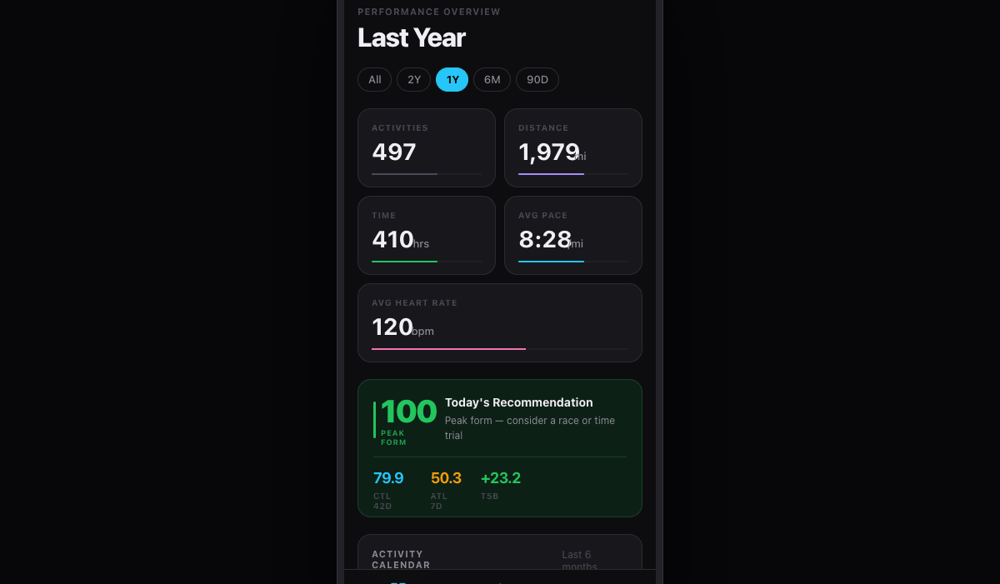
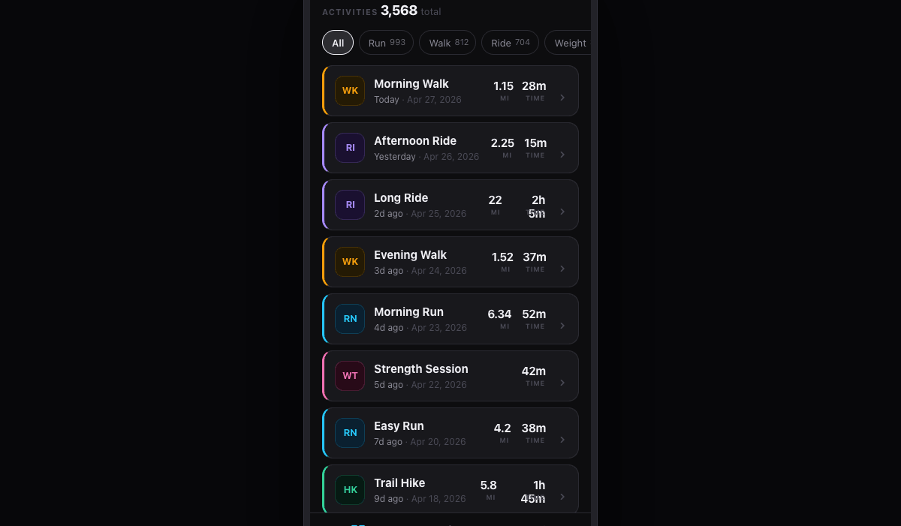
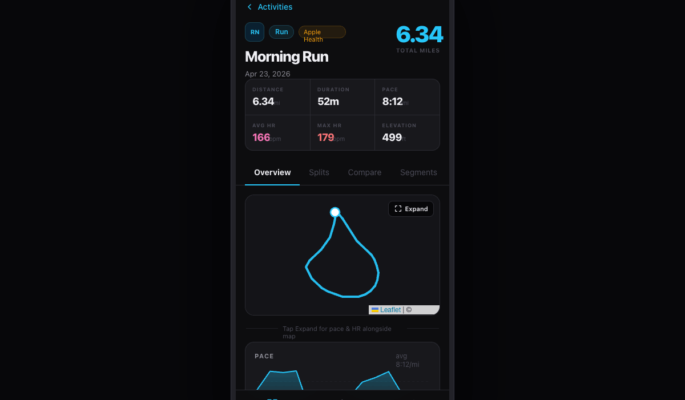
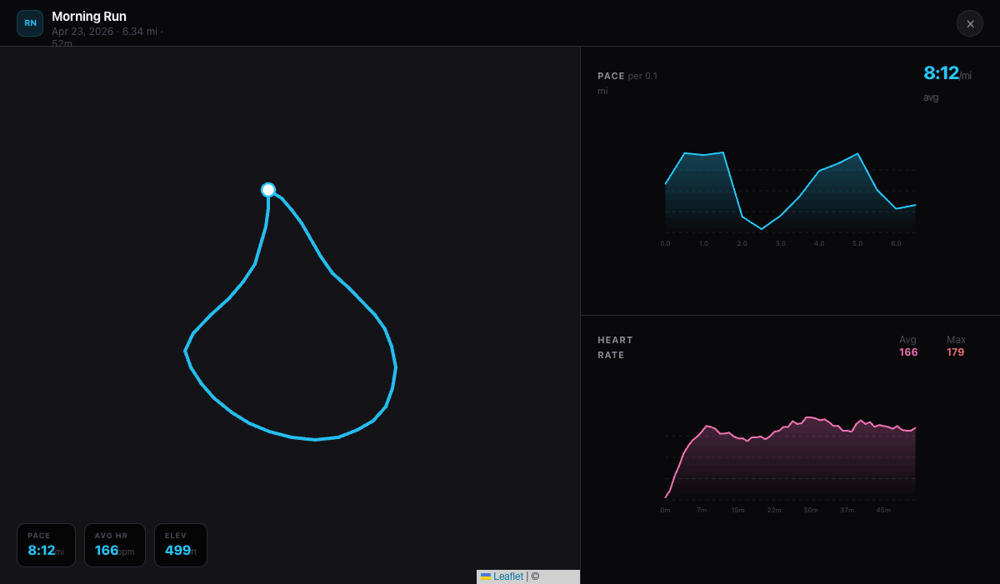

# Handoff: Workout Viz — Mobile Redesign

## Screenshots

| Dashboard | Activities | Activity Detail | Fullscreen Split |
|---|---|---|---|
|  |  |  |  |

---

## Overview

This is a mobile-first redesign of an existing web-based workout tracking app. The design covers two primary sections: the **Dashboard** (performance overview, charts, and analytics) and the **Activities** list + detail view (including a route map, pace chart, heart rate chart, and a fullscreen split view). A third tab, **Advanced**, is stubbed out as a navigation placeholder.

The app is modeled after a phone viewport (390×844 px, iPhone-style) but the fullscreen split view breaks out to fill the entire viewport. Dark theme throughout.

---

## About the Design Files

The files in this bundle are **HTML/JSX design references** — prototypes showing the intended look, layout, and interactions. They are **not** production code to be shipped as-is.

Your task is to **recreate these designs in your existing codebase** (React Native, Expo, SwiftUI, or whatever your app targets) using its established patterns, navigation libraries, and component system. Where no codebase or framework exists yet, React Native with Expo is a natural fit given the mobile-first nature of the work.

The Leaflet map used in the prototype should be swapped for your platform's native map (e.g. `react-native-maps`, MapKit, Google Maps SDK).

---

## Fidelity

**High-fidelity.** These are pixel-close mockups with final colors, typography, spacing, chart shapes, and interactions. Recreate the UI as closely as possible using your platform's equivalent components.

---

## Design Tokens

### Colors

```
Background:        #0d0d0f
Card:              #18181c
Card Alt:          #1e1e24
Border:            #2a2a32
Border Faint:      #1f1f26
Text Primary:      #f0f0f4
Text Secondary:    #8a8a96
Text Muted:        #4a4a56

Accent — Cyan:     #26c6f9   (default accent, Run)
Accent — Violet:   #a78bfa   (Ride, Weekly Mileage)
Accent — Green:    #22c55e   (Fitness, Form)
Accent — Amber:    #f59e0b   (Walk, warnings)
Accent — Pink:     #f472b6   (Weight Training, Avg HR)
Accent — Red:      #f87171   (Max HR)
Accent — Emerald:  #34d399   (Hike)
Accent — Teal:     #22d3ee   (Swim)
Accent — Orange:   #fb923c   (HIIT)
Accent — Purple:   #c084fc   (Workout)
Accent — Fuchsia:  #e879f9   (Functional Strength)
```

### Activity type → color map

| Type                       | Color    | Dark BG  | Abbr |
|----------------------------|----------|----------|------|
| Run                        | #26c6f9  | #0a2030  | RN   |
| Walk                       | #f59e0b  | #241a04  | WK   |
| Ride                       | #a78bfa  | #1a1030  | RI   |
| WeightTraining             | #f472b6  | #280a18  | WT   |
| Hike                       | #34d399  | #051a12  | HK   |
| Swim                       | #22d3ee  | #051820  | SW   |
| HIIT                       | #fb923c  | #221206  | HI   |
| Workout                    | #c084fc  | #160d28  | WO   |
| FunctionalStrengthTraining | #e879f9  | #1e0622  | FS   |
| Crossfit                   | #f87171  | #200808  | CF   |
| Rowing                     | #38bdf8  | #051824  | RW   |
| Yoga                       | #a3e635  | #0e1a04  | YG   |

### Typography

Font family: `DM Sans` (Google Fonts), fallback: `-apple-system, BlinkMacSystemFont, 'Helvetica Neue', sans-serif`

| Role             | Size  | Weight | Letter Spacing | Notes              |
|------------------|-------|--------|----------------|--------------------|
| Page title       | 32px  | 800    | -0.04em        |                    |
| Card title       | 28px  | 700    | -0.03em        |                    |
| Big stat number  | 28–40px | 700–900 | -0.04–0.05em |                    |
| Section header   | 11px  | 700    | 0.1em          | ALL CAPS           |
| Body / list item | 14–15px | 600–700 | -0.02em      |                    |
| Sub-label        | 12–13px | 400–500 | normal        |                    |
| Micro label      | 9–10px | 700   | 0.08–0.1em     | ALL CAPS           |

### Spacing / Radius

| Token        | Value  |
|--------------|--------|
| Page padding | 16px   |
| Card radius  | 16px   |
| Badge radius | ~28% of size (rounded square) |
| Chip radius  | 20px (pill) |
| Gap (grid)   | 10px   |
| Gap (list)   | 8px    |

### Shadows / Borders

Cards use a `1px solid #2a2a32` border on `#18181c` background — no drop shadows. The phone shell in the prototype uses a box-shadow for presentation only; ignore in native.

---

## Screens / Views

### 1. Shell — Phone frame + Bottom Navigation

**Bottom tab bar** (3 tabs): Dashboard · Activities · Advanced

- Height: 82px, pinned to bottom
- Background: `#0d0d0fee` with `backdrop-filter: blur(20px)`
- Border-top: `1px solid #2a2a32`
- Active tab: icon + label in `#26c6f9`; inactive: `#4a4a56`
- Label font: 10px, weight 400/600
- Icons: 22×22px stroke icons (SF Symbols equivalents: square.grid.2x2, waveform.path.ecg, chart.bar)

**Status bar**: standard iOS/Android system status bar, dark content on dark bg.

---

### 2. Dashboard

Scrollable single-column layout. Padding: 16px horizontal, 16px top, 32px bottom.

#### Header
- Overline: `PERFORMANCE OVERVIEW` — 11px, weight 700, #4a4a56, tracking 0.1em
- Title: dynamic period label (e.g. "Last Year") — 32px, weight 800, #f0f0f4
- Below title: pill period selector — options: `All · 2Y · 1Y · 6M · 90D`
  - Active pill: bg `#26c6f9`, text `#000`, border `#26c6f9`
  - Inactive: transparent bg, border `#2a2a32`, text `#8a8a96`
  - Pill padding: 5px 12px, radius 20px, font 13px weight 500/700

#### Stats Grid (2-column)
Cards: `Activities`, `Distance (mi)`, `Time (hrs)`, `Avg Pace (/mi)` — each `StatCard`.
Full-width below: `Avg Heart Rate (bpm)`.

**StatCard anatomy:**
- Padding: 16px 16px 14px
- Micro label: 10px, weight 700, #4a4a56, ALL CAPS
- Value: 28px, weight 700, #f0f0f4, tracking -0.03em
- Unit: 13px, weight 500, #8a8a96
- Bottom bar: full width, 2px, radius 2, bg `#1f1f26`; filled portion 60% wide in accent color

Accent colors per stat: Activities → #4a4a56, Distance → #a78bfa, Time → #22c55e, Avg Pace → #26c6f9, Avg HR → #f472b6

#### Today's Form Card
- Background: `#0d2016`, border: `1px solid #1a4028`
- Large number "100" — 38px, weight 900, #22c55e, tracking -0.05em
- Label "PEAK FORM" — 9px, weight 700, #22c55e
- Description text: 14px weight 700 + 12px #8a8a96
- Divider line, then 3 inline stats: CTL 42D / ATL 7D / TSB — values ~18px weight 700 in cyan/amber/green

#### Activity Calendar (Heatmap)
- 26-week grid, 7 rows (Mon–Sun), cells 11×11px with 2px gap
- Month labels above columns: 9px, #4a4a56
- Day labels left: 8px, #4a4a56 (M, W, F, S only)
- 5 intensity levels: `#1a1a20` → `#0d3320` → `#0f5a30` → `#16a34a` → `#22c55e`
- Legend below right: "Less … More" with 5 color swatches

#### Activity Breakdown
- Row: DonutChart (150px) + legend list
- Donut: SVG circles, stroke-width ~13% of radius, gap between segments = butt linecap
- Center: largest segment's % + label
- Legend: 8px dot, label 12px #8a8a96, % value 12px weight 600 in segment color

Data: Run 197, Walk 158, Weight 57, Ride 37, Hike 17, Other 31

#### Fitness & Fatigue Chart
- 3 lines: Fitness (CTL, #22c55e solid), Fatigue (ATL, #f472b6 dashed 4,3), Form (TSB, #a78bfa dashed 2,3)
- Sub-period selector: 3 Mo / 6 Mo / 1 Yr / 2 Yr / All
- Height ~140px, faint dashed horizontal grid lines
- X axis: 7 month labels

#### Race Predictor
- 2×2 grid of cards: 5K / 10K / Half Marathon / Marathon
- Each: distance label 10px + predicted time 22px weight 800 + pace 11px + accent progress bar
- Accent colors: 5K=#26c6f9, 10K=#a78bfa, HM=#f59e0b, FM=#34d399

#### Personal Records
- Two sport sections: RUN (cyan) / BIKE (violet)
- 2-column grid of record cards, bg `#1e1e24`
- Each: distance 10px muted → time 18px weight 800 accent → date 10px muted

#### Weekly Mileage
- Bar chart, bars in #a78bfa, height 90px
- ~24 weeks of data, x-axis every ~4 bars

---

### 3. Activities List

- Fixed-height screen, no outer scroll — inner list scrolls
- Header: "ACTIVITIES" overline + "3,568 total" count
- Filter chip bar: horizontal scroll, chips for All / Run / Walk / Ride / Weight / Hike / HIIT / Swim
  - Active chip: colored bg + border, inactive: transparent + `#2a2a32` border
- List items: vertically stacked, 8px gap

**Activity Row:**
- Background: `#18181c`, radius 14, border `1px solid #2a2a32`
- Left accent: `3px solid <activityColor>` (border-left override)
- Left: ActivityBadge (40×40px rounded square) — initials in activity color on dark tinted bg
- Center: name 15px weight 700, date 12px muted (relative date in secondary + full date in muted)
- Right: miles (15px weight 700 + "MI" micro label) + time (15px weight 700 + "TIME" micro label) + chevron

---

### 4. Activity Detail

Scrollable, sits above the bottom nav. Back button returns to list.

#### Hero Header
- Back link: "← Activities" in activity color
- Activity type badge (34px) + type pill (colored) + source pill ("Apple Health", amber)
- Activity name: 26px weight 800
- Date: 13px #8a8a96
- Total miles: 40px weight 900 in activity color, top-right aligned (hidden for non-GPS activities)

#### Stats 3×2 Grid
- Unified bordered grid (1px gap, bg = border color for gap effect)
- 6 cells: Distance · Duration · Pace · Avg HR (pink) · Max HR (red) · Elevation
- Each cell: 9px ALL CAPS label + 18px weight 800 value + 10px unit

#### Tab Bar
4 tabs: Overview · Splits · Compare · Segments
- Active tab: white text, 2px bottom border in activity color
- Inactive: `#4a4a56`
- Sticky at top of content area when scrolling

#### Overview Tab

1. **Route Map** — full-width, 210px tall, radius 12, dark CARTO tile layer
   - Route polyline in activity color, weight 3.5, round caps
   - White filled circle (radius 8) at start point
   - "Expand" button: top-right of map, dark frosted bg, expand icon + label

2. **Hint divider** — "Tap Expand for pace & HR alongside map" — centered, 11px muted

3. **Pace Card** — section header "PACE" + avg pace right-aligned
   - Line chart with filled gradient area, x-axis = distance intervals

4. **Heart Rate Card** — "HEART RATE" header + "Avg X · Max X" right
   - Line chart with pink filled gradient, dashed zone lines for Z4 (orange) and Z5 (red)
   - Height ~100px

5. **Activity Profile Card** — radar chart, 5 axes: Pace / Distance / HR / Effort / Duration
   - 170px, filled polygon in activity color at 20% opacity, 3 grid levels

#### Splits Tab
- Pace detail chart (same shape as Overview, 130px tall) + distance/time toggle
- Mile splits table: split number (muted) + pace + HR (pink), separated by faint dividers

#### Fullscreen Split View (Modal overlay)

Triggered by "Expand" button. Covers entire viewport (not just phone frame).

**Layout:** horizontal split
- Left ~58%: route map, fills full height, no border-radius
  - Floating stats overlay: bottom-left, frosted dark chips — Pace / Avg HR / Elevation
- Right ~42%: two equal-height chart panels separated by a horizontal divider
  - Top: Pace chart (150px tall) with section header
  - Bottom: HR chart (150px tall) with avg/max callouts

**Header bar** (56px):
- Left: activity badge + name + date/distance/time
- Right: close button (32px circle, `#18181c` bg)

---

### 5. Advanced Tab (Stub)

List of 5 navigation rows with colored left borders:
1. Best Benchmarks — #26c6f9
2. Pace Over Time — #a78bfa
3. Heart Rate Trend — #f472b6
4. Pace vs Heart Rate — #f59e0b
5. Weekly Mileage — #22c55e

Each row: 15px weight 700 title + 12px muted subtitle + right chevron.

---

## Interactions & Behavior

| Trigger | Action |
|---|---|
| Tap bottom nav tab | Switch active screen; clear any detail view |
| Tap activity row | Push to Activity Detail screen |
| Tap "← Activities" | Pop to Activities list |
| Tap period pill (Dashboard) | Re-render stats for that time range |
| Tap activity type chip | Filter activities list |
| Tap "Expand" on map | Open FullscreenView modal covering full viewport |
| Tap "×" in fullscreen | Dismiss modal, return to detail |
| Drag map | Leaflet / native maps pan (both inline and fullscreen) |

### Transitions
- Tab switches: instant (no animation) or a quick 150ms fade
- Detail push: slide-in from right (standard iOS/Android navigation)
- Fullscreen modal: fade-in overlay, ~200ms

### Chart behavior
- All charts are static renders (no animation on mount in prototype, but consider a short draw-on animation in production)
- Pace chart: line + filled gradient area, x-axis = distance, y-axis = pace in seconds (displayed as MM:SS)
- HR chart: line + filled gradient, dashed zone threshold lines at Z4 (165 bpm) and Z5 (178 bpm)

---

## State Management

| Variable | Type | Notes |
|---|---|---|
| `activeTab` | `'dashboard' \| 'activities' \| 'advanced'` | Bottom nav selection |
| `selectedActivity` | `Activity \| null` | Pushes to detail view when set |
| `period` | `'All' \| '2Y' \| '1Y' \| '6M' \| '90D'` | Dashboard time filter |
| `activityFilter` | activity type string | Activities list filter |
| `showFullscreen` | boolean | Fullscreen split view visibility |
| `activeDetailTab` | `'Overview' \| 'Splits' \| 'Compare' \| 'Segments'` | Detail screen tab |

### Data shape (Activity)

```ts
type Activity = {
  id: number
  type: 'Run' | 'Walk' | 'Ride' | 'WeightTraining' | 'Hike' | 'Swim' | 'HIIT' | ...
  name: string         // human-readable, e.g. "Morning Run"
  date: string         // "Apr 23, 2026"
  relDate: string      // "4d ago"
  miles: number        // 0 for non-GPS activities
  time: string         // "52m" or "2h 5m"
  avgPace: string | null  // "8:12" — null for non-paced activities
  avgHR: number        // bpm
  maxHR: number        // bpm
  elevation: number    // feet gained
}
```

### GPS / Chart data
In the prototype, pace and HR timeseries are generated synthetically. In production, these come from your workout data source (HealthKit, Garmin, Strava, etc.) as arrays of `{ time: number, value: number }` samples.

### Map data
Route is a `[lat, lng][]` polyline. In production, source from GPS track data attached to the activity.

---

## Assets

| Asset | Source | Notes |
|---|---|---|
| Map tiles | CARTO Dark Matter (Leaflet) | Swap for react-native-maps dark style or MapKit dark appearance |
| DM Sans font | Google Fonts | Load via `@expo-google-fonts/dm-sans` or equivalent |
| Icons | Custom inline SVG (stroke icons) | Replace with SF Symbols (iOS) or Material Icons (Android), or use `@expo/vector-icons` |

---

## Files

| File | Contents |
|---|---|
| `Workout Viz.html` | Main app shell — phone frame, root React app, tab routing, tweaks panel |
| `app-components.jsx` | Shared primitives: colors, ActivityBadge, Card, BottomNav, StatCard, all SVG charts (DonutChart, BarChart, SparkLine, RadarChart, PaceLineChart, FitnessFatigueChart, ActivityCalendar) |
| `Dashboard.jsx` | Full Dashboard screen component |
| `Activities.jsx` | Activities list, ActivityDetail, FullscreenView, RouteMap (Leaflet), HRLineChart |

Open `Workout Viz.html` directly in a browser to interact with the prototype. No build step needed.

---

## Notes for Implementation

- The prototype renders inside a fixed 390×844px phone frame for presentation. In production, use the device's actual safe-area bounds.
- The "Expand" fullscreen view uses `ReactDOM.createPortal` to break out of the phone frame. In native, this would be a `Modal` component (React Native) or a `.fullScreenCover` / `.sheet` (SwiftUI).
- All scroll containers use `-webkit-overflow-scrolling: touch` and hidden scrollbars — replicate with native `ScrollView` / `FlatList` with `showsVerticalScrollIndicator={false}`.
- The Leaflet map needs to be replaced with a native map component. Apply a dark map style and draw the route as a `Polyline` overlay. The start-of-route dot is a custom `Marker`.
- Per-activity colors are derived purely from the activity `type` string — keep a central lookup table (as in `app-components.jsx` `ACTIVITY_CFG`) so colors stay consistent everywhere.
